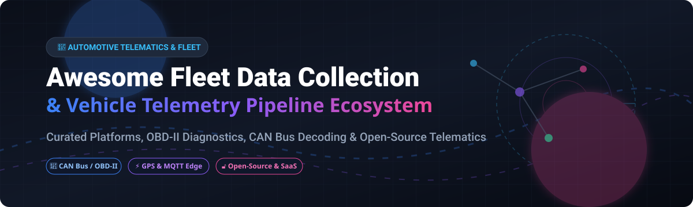

# Awesome-Automotive-Fleet-Data-Collection

# Awesome-Automotive-Fleet-Data-Collection 🚗 📡

  

  

  

  

  

  

  

---

## 🌟 Top Automotive Fleet Data Collection Ecosystem

**Curated List of Commercial Connected Vehicle Platforms & Open-Source Telematics Frameworks**  

*Focused on OBD-II Diagnostics, CAN Bus Decoding, GPS Fleet Tracking, Vehicle-to-Cloud Telemetry & Self-Hosted Data Pipelines*  

**Last updated: October 2026** 📅

---

### 📌 Overview & SEO Summary

Welcome to the ultimate curated directory of **automotive fleet data collection platforms**, **open-source telematics frameworks**, and **vehicle-to-cloud telemetry pipelines**. Whether you are looking for enterprise-grade commercial solutions (such as *Samsara*, *Geotab*, and *Motive*), or self-hostable open-source alternatives (like *Open Vehicle Monitoring System*, *Routario*, and *CAN-DAQ*), this list covers category leaders, edge processing engines, and privacy-respecting vehicle data architectures.

---

## 📑 Table of Contents

- [🏢 SaaS & Commercial Platforms](#-saas--commercial-platforms)

- [🔓 Open-Source GitHub Projects](#-open-source-github-projects)

- [🛠️ How to Contribute](#%EF%B8%8F-how-to-contribute)

- [📊 Star History](#-star-history)

- [🤝 Support & Sponsorship](#-support--sponsorship)

- [⚠️ Disclaimer](#%EF%B8%8F-disclaimer)

---

## 🏢 SaaS / Commercial Platforms

The automotive fleet data collection market is dominated by full-stack telematics providers offering hardware, connectivity, and analytics as a bundled service. Pricing models typically combine per-vehicle monthly fees with hardware costs. AWS IoT FleetWise provides a cloud-native ingestion layer for OEMs, while specialized vendors like Samsara and Geotab offer turnkey fleet management with deep integration into operations workflows.

| SaaS / Commercial Platform | Company / Owner | Valuation / Market Cap | Standard Edition Starting Price | Free Tier / Free Trial Limits | Description |

| :--- | :--- | :--- | :--- | :--- | :--- |

| **[AWS IoT FleetWise](https://aws.amazon.com/iot-fleetwise/)** ☁️ | Amazon | ~$2.0 Trillion | Pay-as-you-go for data ingestion, storage, and processing | **Free tier for AWS IoT Core** (limited messages) | **Cloud-native vehicle data collection** — Collects, transforms, and transfers vehicle data to the cloud. Vehicle models define signals and actuators. Edge Agent runs on vehicle gateway. |

| **[Samsara](https://www.samsara.com/)** 🚛 | Samsara Inc. | ~$20 Billion (Public) | Custom per-vehicle pricing (hardware + subscription) | **Free trial available**; no permanent free tier | **Connected operations platform** — Fleet telematics, video safety, driver workflows, and equipment monitoring. Integrated hardware with cellular connectivity. |

| **[Geotab](https://www.geotab.com/)** 📊 | Geotab Inc. | Private | Custom per-vehicle pricing (hardware + subscription) | **Free trial available**; no permanent free tier | **Open-platform fleet telematics** — GO device with extensive vehicle support. Marketplace of third-party apps. Data available via SDK and API. |

| **[Motive](https://gomotive.com/)** 🚚 | Motive (formerly KeepTruckin) | Private | Custom per-vehicle pricing | **Free trial available**; no permanent free tier | **Fleet management and ELD compliance** — AI dash cams, GPS tracking, fuel monitoring, and maintenance alerts. Focus on trucking and logistics. |

| **[Applied Intuition](https://www.appliedintuition.com/)** 🤖 | Applied Intuition | ~$6 Billion | Custom enterprise licensing | **Demo available** | **Autonomous vehicle development platform** — Data collection, simulation, and validation for AV and ADAS. Used by major OEMs. |

| **[Mojio](https://www.mojio.com/)** 📱 | Mojio | Private | Custom per-vehicle pricing | **Developer sandbox available** | **Connected car platform** — Aftermarket OBD-II devices with cellular connectivity. Focus on insurance telematics and fleet management. |

| **[Sibros](https://www.sibros.tech/)** 🔄 | Sibros | Private | Custom enterprise licensing | **Demo available** | **Deep connected vehicle platform** — OTA updates, data collection, and fleet management for software-defined vehicles. Used by OEMs. |

| **[BlackBerry IVY](https://www.blackberry.com/us/en/products/blackberry-ivy)** 🫐 | BlackBerry | ~$1 Billion (Public) | Custom enterprise licensing | **Developer preview available** | **Edge vehicle data platform** — Collects and processes vehicle sensor data at the edge. Normalizes data across vehicle architectures. |

| **[Sonatus](https://www.sonatus.com/)** ⚙️ | Sonatus | Private | Custom enterprise licensing | **Demo available** | **Software-defined vehicle platform** — Dynamic data collection, OTA updates, and network management. Used by Hyundai, Kia, and Genesis. |

| **[CerebrumX](https://www.cerebrumx.ai/)** 🧠 | CerebrumX | Private | Custom enterprise licensing | **Pilot programs available** | **AI-powered connected vehicle data platform** — Aggregates data from multiple sources. Focus on insurance, fleet, and smart city applications. |

---

## 🔓 Open-Source GitHub Projects

*Sorted by GitHub_Stars_Count (Descending)* 🌟

- **[Open Vehicle Monitoring System 3 (OVMS)](https://github.com/openvehicles/Open-Vehicle-Monitoring-System-3)**   

  **The most comprehensive open-source vehicle telematics platform**, open-source. **Native support for 35+ electric vehicles** including Tesla Model S, Nissan Leaf, BMW i3, Renault Zoe, Hyundai Ioniq 5, and VW e-Golf . ESP32-based hardware module with 3x CAN buses, WiFi, Bluetooth, and cellular modem options. Reads vehicle data via CAN bus, OBD-II, and DBC files. Server-side telemetry with MQTT. **The gold standard for open-source EV monitoring** . 🚗

- **[Routario](https://github.com/bkbilly/Routario)**   

  **Self-hosted GPS fleet tracking with real-time analytics**, open-source. **No subscriptions, no data leaving your server** . Connects directly to GPS hardware (Teltonika, Queclink, Concox, TK103) over TCP/UDP. Features: live fleet map, geofences, speed limit detection, trip history, driver management, fuel logbook, and multi-channel alerts (Telegram, Discord, Slack, email). Python/FastAPI backend with Vanilla JS frontend. **The most feature-complete open-source fleet tracking platform** . 🛰️

- **[CAN-DAQ](https://github.com/...)**   

  **Complete open-source CAN bus data acquisition device and software**, open-source. **Addresses the integration gap between commercial tools and fragmented open-source alternatives** . ESP32-S3 hardware with MCP2561 CAN transceiver. PC-side GUI with DBC parsing, real-time plotting (Matplotlib), and SQLite-backed data logging. Features automatic signal interpretation via CAN Database files and high-resolution plotting. **The first unified open-source hardware+software CAN DAQ solution** . 📊

- **[telemetry-obd](https://github.com/thatlarrypearson/telemetry-obd)**   

  **OBD-II data logger with command pattern optimization**, open-source. **16 stars** . Supports three command patterns: Startup (one-time commands), Housekeeping (slow-changing values), and Cycle (fast-changing values like RPM and MAF). Outputs hybrid JSON records with ISO timestamps. **Handles "no response" commands gracefully** — identifies commands that are intermittently supported . Designed for Raspberry Pi deployment. 📝

- **[Fleet Management System](https://pypi.org/project/fleet-management-system/)**   

  **Python-based telematics platform with OBD-II, GPS, and CAN decoding**, open-source. **Complete pipeline** from OBD-II diagnostics (SAE J1850, ISO 9141, ISO 14230, ISO 15765 CAN) to GPS tracking (NMEA 0183) to CAN bus decoding . **600+ DTC codes** with severity assessment and maintenance cost estimates. Real-time alert engine with configurable thresholds (speeding, engine overheat, low fuel, harsh braking). FastAPI backend with Docker deployment. **The most comprehensive Python telematics framework** . 🔧

- **[CAN Logger](https://pypi.org/project/can-logger/)**   

  **CAN/CAN-FD frame logging to SQLite**, open-source. **Lightweight and focused** — listens on CAN interfaces, logs frames to SQLite database, and provides filtering tools by date, arbitration ID, or message count . Docker support with virtual CAN interface (`vcan0`). **Ideal for simple CAN bus monitoring and analysis** . 📡

- **[obd-tui](https://github.com/goabonga/obd-tui)**   

  **Terminal dashboard for ELM327 OBD-II adapters**, MIT licensed . **Auto-detects adapters** and queries vehicle-supported PIDs. Tabbed Textual UI with Engine, Turbo/Air, EGR, Diagnostics, and Faults panels. **Five-minute rolling trend charts** for RPM, coolant, and MAF. JSON Lines recording for pandas analysis. **Demo mode** runs without hardware — `obd-tui --demo` . 🖥️

- **[pycangui](https://github.com/...)**   

  **Graphical CAN bus tool with protocol support**, Apache-2.0 licensed . **Comprehensive protocol coverage**: CANopen, UDS (ISO-TP), J1939, XCP, CCP. Live trace with CAN FD, DBC message editing, and signal plotting. **Python scripting hooks with hot reload** for custom analytics. Simulated nodes for testing without hardware. **The most feature-rich open-source CAN analysis GUI** . 🎛️

- **[obd_project](https://github.com/AlexLangan/obd_project)**   

  **Python OBD-II data logger with PID discovery**, open-source. **Simple and focused** — logs engine RPM, speed, throttle, load, coolant temp, fuel level, and intake temp to CSV . **PID discovery utility** finds vehicle-supported parameters. Docker support. Graceful error handling when vehicle connection unavailable. **Ideal for quick OBD-II data capture** . 🐍

- **[Nexus SDV](https://github.com/googlecloudplatform/nexus-sdv)**   

  **Google's reference connected vehicle platform**, Apache-2.0 licensed . **Android Automotive OS VHAL integration** for vehicle data collection. NATS protocol for high-performance telemetry transport. Google BigTable for scalable processing. **Automotive-grade security** with PKI and OpenID 2.0. Terraform-based deployment to Google Cloud. **Digital Twin architecture** acts as Virtual ECU for AI/ML workloads . ☁️

- **[Eclipse Connected Services Platform (ECSP)](https://www.eclipse.org/ecsp/)**   

  **Harman's open-sourced connected vehicle platform**, Eclipse Foundation project . **Production-proven at scale** — supports up to 100,000 vehicles. MQTT for vehicle-to-cloud connectivity, Apache Kafka for high-throughput data processing. **Complete stack**: vehicle client (C++), cloud platform, remote operations app, vehicle simulator, and iOS/Android reference app. Kubernetes-based deployment with ArgoCD. **Used in large-scale production by car makers and fleet operators** . 🏗️

- **[SDV Telemetry (Android Automotive)](https://source.android.google.cn/docs/automotive/sdv/workstreams/telemetry)**   

  **Android's official vehicle telemetry framework**, open-source . **Rust implementation** for memory safety. Multiple telemetry instances per vehicle for zone-based data collection. **Telemetry Campaigns** configured in the cloud define what to collect, how to process, and when to report. **Edge processing engine** reduces cloud data transfer. SDK for Rust (Java experimental). Simulator for validating configurations before deployment. **The standard for Android Automotive OS telemetry** . 🤖

- **[ITS Telematics (USDOT)](https://github.com/usdot-fhwa-stol/its-telematics)**   

  **USDOT's open-source fleet telematics module**, Apache-2.0 licensed . **Designed for Cooperative Driving Automation (CDA) research** — installs on any vehicle including CARMA Platform and production vehicles. Real-time wireless data transmission to cloud. **Compatible with CARMA Streets and CARMA Cloud**. Data Processing & Visualization Tool included for analysis. **Government-backed open-source telematics for research and education** . 🏛️

- **[Traccar](https://github.com/traccar/traccar)**   

  **Open-source GPS tracking server**, Apache-2.0 licensed. **Evaluated in academic research** as one of three primary open-source fleet management systems alongside OpenGTS and OpenERP . Supports 200+ GPS protocols. Real-time tracking, geofencing, and event alerts. **Mature and widely deployed** — the de facto standard for open-source fleet tracking . 🗺️

- **[OpenGTS](https://github.com/...)**   

  **Open GPS Tracking System**, Apache-2.0 licensed. **One of the three primary open-source fleet management systems evaluated in academic research** . Java-based, supports multiple GPS devices. Web-based fleet tracking with reports and alerts. **Enterprise-capable open-source tracking platform** . 📍

---

## 🛠️ How to Contribute

Contributions are welcome! Follow these steps to submit new automotive fleet data collection platforms or open-source telematics software:

1. 🍴 **Fork** the repository.

2. 📝 **Add/edit** entries in `README.md` maintaining table/list structure and formatting.

3. 🔗 Include project title, official website/GitHub link, exact Stars_Count, license, and brief description.

4. 🚀 Submit a **Pull Request** with a descriptive summary of your changes.

---

## 📊 Star History

---

## 🤝 Support & Sponsorship

If you find this automotive fleet data collection repository useful, please consider supporting the project:

- ⭐ **Star** this repository to increase visibility!

- 🔀 **Fork** and share with fellow developers, fleet managers, and automotive engineers.

- ☕ **Sponsor & Buy Me a Coffee**: Support ongoing open-source curation via the [GitHub Sponsor Dashboard](https://github.com/sponsors/ishandutta2007).

---

## ⚠️ Disclaimer

- This is a **community-curated** list — not exhaustive and not an endorsement. ℹ️

- Vehicle data collection raises significant privacy and security concerns. **Review data ownership, consent requirements, and regulatory compliance** (GDPR, CCPA, automotive cybersecurity standards) before deploying any telematics solution. Open-source tools like OVMS and Routario provide self-hosted ownership, but commercial platforms offer managed SLAs and 24/7 support.

- CAN bus access requires proper training. **Incorrect bus connections or bitrate mismatches can disrupt vehicle networks** and potentially affect safety-critical systems. Always follow manufacturer guidelines and use appropriate hardware isolation . 🚗

---

  <b>Made with ❤️ for fleet managers, automotive engineers, and open-source telematics advocates.</b>

